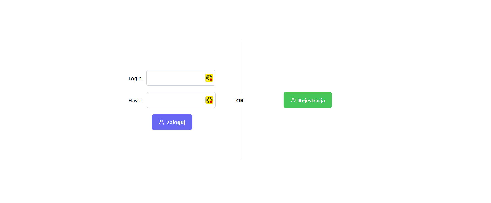

# My Doctor

My Doctor is an interactive platform that enables patients to book medical appointments with doctors. It offers a user-friendly and aesthetically pleasing interface that allows you to manage your medical appointments all in one place.

## Features
- **Account Creation**: Easily sign up.  New users can create a Doctor or Patient account.
- **Doctor Search**: Search for doctors by specialty and location.
- **Appointment Booking**: Select available terms and book appointments.
- **Account Management**: Users can update their personal information.
- **Availability Map**: Find doctors and their practices on an interactive map.
 - **Schedule Creation by Doctors**: Doctors have the ability to create and manage their appointment schedules, setting available slots for patients to book.
  - **Appointment Scheduling**: Booked appointment slots are saved, providing both doctors and patients with a record of scheduled visits.
   - **Record of Scheduled Visits**: Both doctors and patients can view a history of scheduled.
- **Payment System**: Securely pay for your visits through Stripe.

## Quick Start

1. **Registration/Authentication**: Create your account or log in to manage your appointments.
2. **Search for a Doctor**: Use the search functionality to find the right specialist.
3. **Book an Appointment**: Choose the appointment slot that suits you and book it.
4. **Confirmation and Payment**: Confirm the details of your appointment and make an online payment.

## Technologies

- **React.js**
- **@reduxjs/toolkit**
- **React Router**
- **TypeScript**
- **Google Maps API**
- **Stripe API**
- **React Hook Form**
- **React Query**
- **Date-fns**
- **ESLint**
- **Prettier**

## Test Accounts

To provide with the ability to fully test the application, the following test accounts have been set up:

- **Doctor Account**
  - Login: `abittner`
  - Password: `12345678`

- **Patient Account**
  - Login: `Jan123`
  - Password: `12345678`


For payment testing purposes, use the following test credit card information:

- Card Number: `4242 4242 4242 4242`
- Expiration Date: `12/26`
- CVC: `111`

## Instalation

To run the application locally, clone the repository and install the dependencies:

```bash
git clone https://github.com/PioR94/HospitalFront.git
cd HospitalFront
npm install
npm start
```

Create a .env file in the root directory of the project and add the following environment variables:

REACT_APP_BASE_URL=<your-backend-api-url>
REACT_APP_GOOGLE_MAPS_API_KEY=<your-google-maps-api-key>
REACT_APP_STRIPE_PUBLIC_KEY=<your-stripe-public-key>


## Backend Support

This application requires a backend service for full functionality. Download the backend application from [Backend Repository](https://github.com/PioR94/HospitalBack).

## Future Development

- **Doctor Reviews and Ratings**: Introduce a feature allowing patients to leave reviews and rate their experiences with doctors. 
  
- **Service Types and Pricing**: Enable doctors to add a list of services they offer along with pricing information. 

## Screenshots





## Contribution

Your feedback and contributions are welcome! If you have suggestions or want to report a bug, please create an issue in our GitHub repository.

## License

This project is licensed under the MIT License. See the LICENSE file for details.
